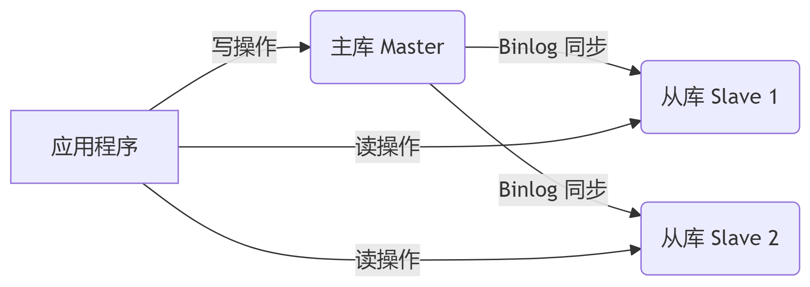

## .ini 文件

### INI 文件详解

#### **1. INI 文件基本概念**

INI（Initialization）文件是一种简单的**键值对**配置文件格式，广泛用于存储应用程序的配置信息。其特点如下：

| **特点**       | **说明**                                                   |
| -------------- | ---------------------------------------------------------- |
| **层级结构**   | 使用 `[section]` 划分配置块，每个块内包含多个键值对。      |
| **键值对格式** | `key = value`，等号（`=`）或冒号（`:`）均可作为分隔符。    |
| **注释支持**   | 分号 `;` 或井号 `#` 开头的行视为注释。                     |
| **跨平台兼容** | 无复杂语法，适合轻量级配置，广泛支持 Windows/Linux/macOS。 |

#### **2. INI 文件示例**

```ini
; 数据库配置
[database]
host = 127.0.0.1
port = 3306
username = root
password = secret
enable_ssl = true

; 服务器配置
[server]
listen = :8080
log_level = debug
```

------

### Go 语言读取 INI 文件的实现方法

#### **1. 使用第三方库 `go-ini`**

Go 标准库未内置 INI 解析器，推荐使用社区维护的 **[go-ini/ini](https://github.com/go-ini/ini)** 库。

##### **安装库**

```bash
go get github.com/go-ini/ini
```

#### **2. 基础用法示例**

```go
package main

import (
	"fmt"
	"log"
	"gopkg.in/ini.v1"
)

func main() {
	// 加载 INI 文件
	cfg, err := ini.Load("config.ini")
	if err != nil {
		log.Fatalf("读取配置文件失败: %v", err)
	}

	// 读取 [database] 节的配置
	dbSection := cfg.Section("database")
	dbHost := dbSection.Key("host").String()
	dbPort, _ := dbSection.Key("port").Int()
	enableSSL, _ := dbSection.Key("enable_ssl").Bool()

	// 读取 [server] 节的配置
	serverSection := cfg.Section("server")
	listenAddr := serverSection.Key("listen").String()
	logLevel := serverSection.Key("log_level").String()

	// 打印配置
	fmt.Printf("数据库地址: %s:%d (SSL: %t)\n", dbHost, dbPort, enableSSL)
	fmt.Printf("服务器监听: %s, 日志级别: %s\n", listenAddr, logLevel)
}
```

------

#### **3. 进阶用法**

##### **(1) 直接映射到结构体**

```go
type DatabaseConfig struct {
	Host     string `ini:"host"`
	Port     int    `ini:"port"`
	Username string `ini:"username"`
	Password string `ini:"password"`
	EnableSSL bool  `ini:"enable_ssl"`
}

type ServerConfig struct {
	Listen    string `ini:"listen"`
	LogLevel  string `ini:"log_level"`
}

func main() {
	cfg, err := ini.Load("config.ini")
	if err != nil {
		log.Fatal(err)
	}

	// 映射配置到结构体
	dbCfg := new(DatabaseConfig)
	if err := cfg.Section("database").MapTo(dbCfg); err != nil {
		log.Fatal(err)
	}

	serverCfg := new(ServerConfig)
	if err := cfg.Section("server").MapTo(serverCfg); err != nil {
		log.Fatal(err)
	}

	fmt.Printf("数据库用户: %s\n", dbCfg.Username)
}
```

##### **(2) 设置默认值**

```go
key := cfg.Section("database").Key("max_connections")
maxConn := key.MustInt(100) // 若配置项不存在，默认值 100
```

##### **(3) 写入 INI 文件**

```go
cfg := ini.Empty()

// 创建 [app] 节并写入配置
appSection := cfg.Section("app")
appSection.Key("version").SetValue("1.0.0")
appSection.Key("debug").SetValue("false")

// 保存到文件
err := cfg.SaveTo("app.ini")
if err != nil {
	log.Fatal(err)
}
```

------

#### **4. 常见问题处理**

| **问题**         | **解决方案**                                                 |
| ---------------- | ------------------------------------------------------------ |
| 键名大小写敏感   | `go-ini` 默认不区分大小写，可通过 `cfg = ini.LoadOptions{Insensitive: false}` 设置敏感。 |
| 节不存在时的处理 | 使用 `cfg.Section("section").Key("key").MustXxx()` 避免 panic。 |
| 解析布尔值       | 支持 `true`/`false`、`1`/`0`、`on`/`off` 等多种格式。        |

------

### **5. 对比其他格式**

| **格式** | **优点**                 | **缺点**               | **适用场景**            |
| -------- | ------------------------ | ---------------------- | ----------------------- |
| **INI**  | 简单易读，轻量级         | 不支持复杂数据类型     | 小型项目、分层配置      |
| **JSON** | 结构化数据，类型明确     | 冗余字符多，可读性稍差 | 前后端交互、复杂配置    |
| **YAML** | 可读性极佳，支持复杂结构 | 缩进敏感，易出错       | DevOps、Kubernetes 配置 |

------

### **总结**

- **INI 文件适用场景**：轻量级配置（如数据库连接、服务器参数）。
- **Go 实现方案**：推荐 `go-ini` 库，支持读取、写入和结构体映射。
- **最佳实践**：将配置映射到结构体，提升代码可维护性。

## 数据库主从复制

### 主从复制

主库（Master）负责处理写操作（INSERT/UPDATE/DELETE），从库（Slave）通过复制主库的二进制日志（Binlog）同步数据，只处理读操作（SELECT）。



| **优势**     | **说明**                                                     |
| ------------ | ------------------------------------------------------------ |
| **读写分离** | 写操作集中在主库，读操作分散到多个从库，提升并发性能。       |
| **高可用性** | 主库故障时，可从从库快速切换为新主库（需配合哨兵或集群管理工具）。 |
| **数据备份** | 从库天然是主库的实时备份，避免单点故障导致数据丢失。         |
| **负载均衡** | 通过多个从库分担读请求压力，适合读多写少的场景（如电商、社交应用）。 |

#### **(1) 性能优化**

- **场景**：当应用 80% 以上的请求是读操作时（如商品详情页、新闻列表），主从分离可显著降低主库压力。
- **效果**：通过横向扩展从库数量，线性提升读吞吐量。

#### **(2) 高并发支持**

- **问题**：单库连接数有限（如 MySQL 默认最大连接数 151），高并发时易达到瓶颈。
- **解决**：主库专注写操作，从库处理读操作，突破连接数限制。

#### **(3) 数据安全性**

- **容灾恢复**：从库作为实时备份，主库故障时可快速恢复数据。
- **读写隔离**：避免复杂查询（如报表分析）影响核心业务写入性能。

### 主从配置最佳实践

| **实践要点**     | **说明**                                                     |
| ---------------- | ------------------------------------------------------------ |
| **从库数量**     | 建议至少 2 个从库，避免单点故障。                            |
| **读写分离策略** | 写操作强制走主库，读操作根据业务容忍度选择从库。             |
| **健康检查**     | 定期监控从库复制状态（如 `SHOW SLAVE STATUS`），自动剔除异常节点。 |
| **故障切换**     | 使用 Keepalived 或 Consul 实现主库故障自动切换。             |

## AES 对称加密(加密金额)

**AES（Advanced Encryption Standard）** 是一种广泛使用的对称加密算法，特点如下：

| **特性**     | **说明**                                                     |
| ------------ | ------------------------------------------------------------ |
| **对称性**   | 加密与解密使用 **同一密钥**，需确保密钥传输安全。            |
| **分组加密** | 数据按 **128位（16字节）** 分组处理，密钥长度支持 **128/192/256位**。 |
| **工作模式** | 如 ECB、CBC、CTR 等，不同模式安全性差异大（ECB 不安全，推荐 CBC 或 GCM）。 |
| **填充规则** | 数据长度不足分组大小时需填充，常用 PKCS#7（如缺3字节则填充 `0x03` 三次）。 |

## bcrypt 加密密码


## token 签发与解析

